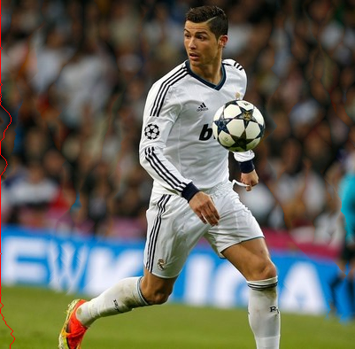
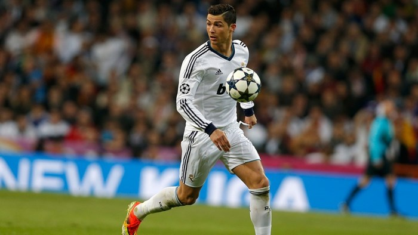
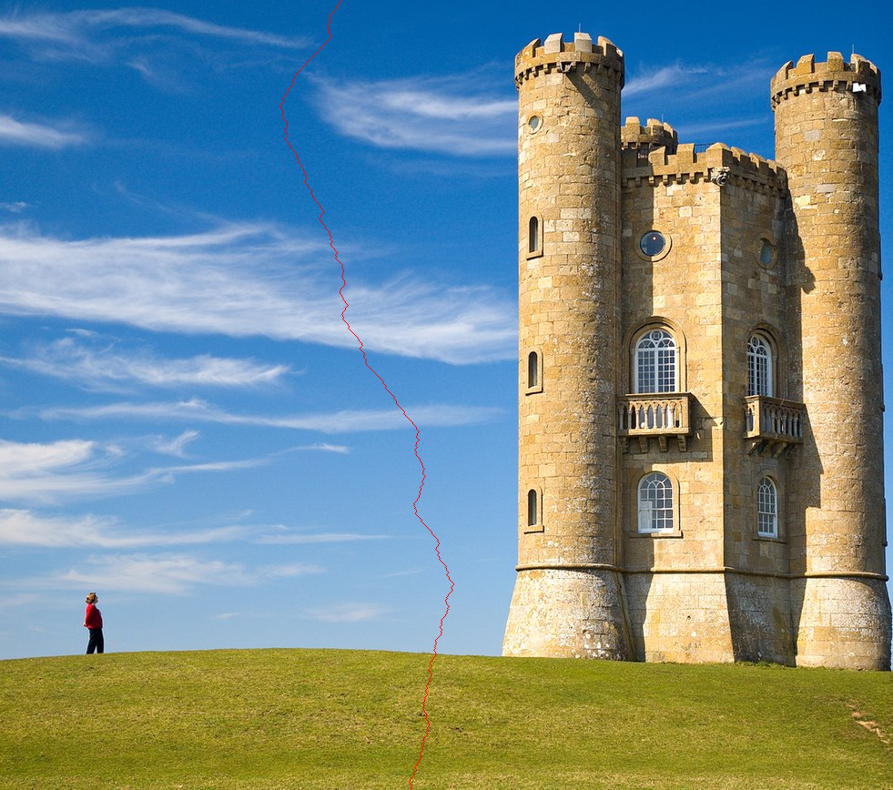
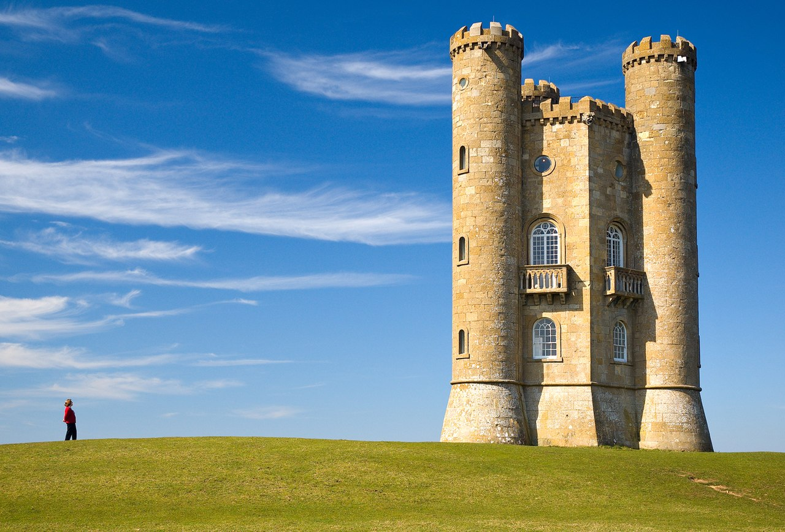

# Seam Carving    [](https://github.com/Naereen/StrapDown.js/blob/master/LICENSE)

[Seam carving](https://en.wikipedia.org/wiki/Seam_carving) (or liquid rescaling) is an algorithm for content-aware image resizing, developed by Mitsubishi Electric Research Laboratories (MERL). It functions by establishing a number of seams (paths of least importance) in an image and automatically removes seams to reduce image size or inserts seams to extend it.
Read the paper at:
- [Original paper](https://perso.crans.org/frenoy/matlab2012/seamcarving.pdf)
- [ACM Digital Library](https://dl.acm.org/doi/10.1145/1275808.1276390)
## Dependencies

Make sure to install the following minimal dependencies to avoid build errors:
- [Glew](https://archlinux.org/packages/extra/x86_64/glew/)
- [lib32-glew](https://archlinux.org/packages/multilib/x86_64/lib32-glew/)
- [CMake](https://cmake.org/download/)
- [OpenCV](https://opencv.org/releases/)

## Build

```sh
git clone https://github.com/wthrajat/seamcarving.git
cd seamcarving && mkdir build && cd build && cmake .. && make
```
After compilation, this will build an executable `"seam_carving"` at `./build/app/`:
```sh
./build/app/seam_carving
```

## Usage

```sh
./build/app/seam_carving <input_image> <direction> <number of seams> <mode> <x> <y> <w> <h>

# OR

./build/app/seam_carving <input_image> <direction> <number of seams>

```

## Format of arguments
```rust
<input_image> : image_name.extension

<direction> : 'h'(horizontally) OR 'v'(vertically)

<mode> : 'r' OR 'p'
'r' for removal
'p' for protection

<x> <y> <w> <h> : Specifies the region of interest

```

## Examples


```rust
./build/app/seam_carving assets/ronaldo.jpeg v 300
```
Resized | Original
--- | ---
 | 

```rust
./build/app/seam_carving assets/tower.jpg v 300
```
Resized | Original
--- | ---
 | 

## Video demo

